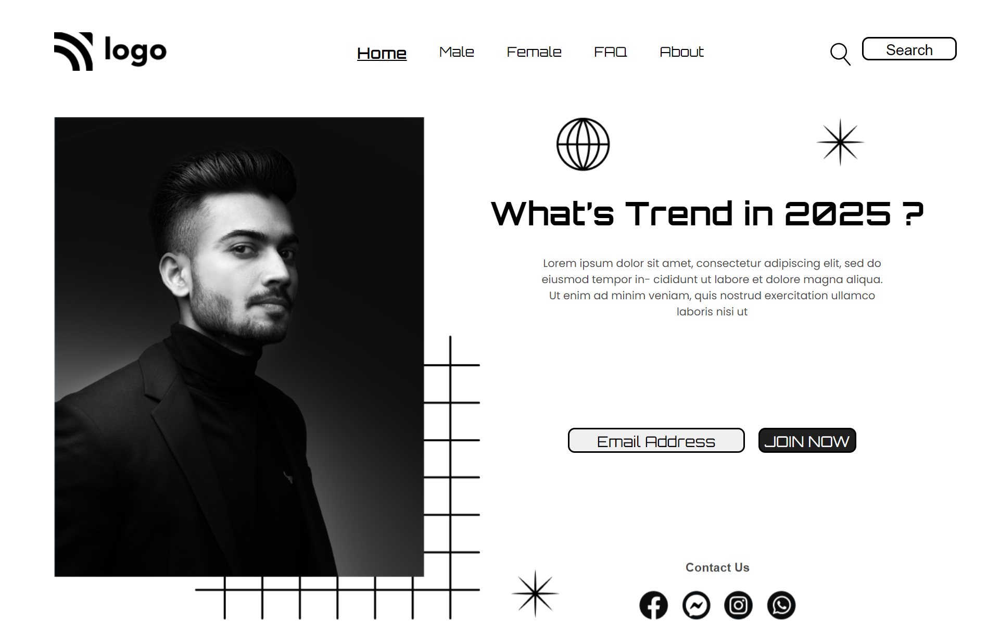

# Project-01-Style  -   and    :point_right: [Click Here to See Full Website](https://manwithstyle.netlify.app/) :point_left:
#### By Deep 

> Here's You can see Live Deployed  ~       

[Click Here to See Full Website](https://manwithstyle.netlify.app/)

## What I learned from this Project?

- [X] I learned about **Layout** making it first.
- [X] I also learned how to use **Icons** and **Image-Positioning**.
- [X] I also learned about **Box Shadow**.
- [X] I Learned about How to use **View Port**.
- [X] I also learned how to use **Hover Effect**.

> This project took around **5 hours** to complete.

#### Show some ❤️ by Liking ⭐ To this Repository. Also Follow me on 

  

  

### Thank You....
